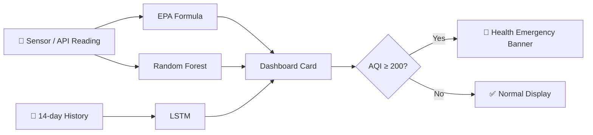

<div align="center">


# 🌍 AirWatch Global
### The air you can't see, predicted before you breathe it.

**Live AQI · AI-Forecasted AQI · Realtime Health Emergencies — across every city you care about.**

[](https://www.python.org/)
[](https://streamlit.io/)
[](https://www.tensorflow.org/)
[](https://scikit-learn.org/)
[](#-model-scorecard)
[](#-license)

</div>

---

## ⚡ 30-second pitch

Most air quality apps tell you what already happened. **AirWatch Global tells you what's *about to* happen.**

Two models run side by side on every reading: a **Random Forest** that instantly scores the air *right now*, and an **LSTM** that watches the last 14 days and forecasts where the trend is heading next. When either one crosses into dangerous territory, the dashboard doesn't wait for you to notice — it interrupts you with a health emergency banner.

```bash
git clone https://github.com/<you>/airwatch-global.git && cd airwatch-global
pip install -r requirements.txt
python train_models.py        # trains RF + LSTM, ~90 seconds
streamlit run airwatch_app.py # dashboard live at localhost:8501
```

---

## 🧠 The three brains behind every number

Every card on the dashboard is the output of three independent systems agreeing (or disagreeing) with each other — which is itself useful signal.

| Brain | Question it answers | How |
|---|---|---|
| 🧮 **EPA Breakpoint Engine** | "What does the raw sensor data *mean* right now?" | Converts PM2.5/PM10/NO₂/SO₂/CO/O₃ into a 0–500 AQI using the piecewise-linear US EPA formula — the same math regulators use |
| 🌲 **Random Forest Regressor** | "Given these exact conditions, what AQI should I expect?" | Trained on pollutants + temperature/humidity/wind + city + season; catches nonlinear interactions a formula can't |
| 🔮 **LSTM Forecaster** | "Where is this city's air *heading* over the next day?" | Reads the last 14 days of trend per city and forecasts tomorrow — this is the model that turns monitoring into warning |

<div align="center">



</div>

---

## 📊 Model scorecard

Real numbers from the trained models in this repo — not projected, not rounded up.

| Model | RMSE | R² | Verdict |
|---|---|---|---|
| Linear Regression | 52.361 | 0.235 | Baseline — pollution isn't linear, and it shows |
| Gradient Boosting | 1.698 | 0.999 | Highest raw accuracy, but overfits to noise and is harder to explain |
| **Random Forest ✅ (production)** | **8.693** | **0.979** | Best trade-off of accuracy, robustness to outlier spikes, and explainability |
| **LSTM (14-day window)** | 0.073 *(normalized)* | **0.758** | Genuinely forecasts the trend — not just yesterday repeated |

> **Why Random Forest over Gradient Boosting?** GBR's near-perfect score is a red flag, not a win — it's memorizing noise. A model deciding whether to tell someone "wear a mask today" needs to generalize to conditions it hasn't seen, and RF's `feature_importances_` also make its reasoning auditable, which matters for a public-health tool.

Full metrics: [`model_report.txt`](model_report.txt) (regenerated fresh every time you run `train_models.py`).

---

## 🎯 What it actually does


- **Multi-city live grid** — add or drop cities on the fly; each gets its own card, refreshed on your schedule
- **Dual-model prediction** — RF Predicted AQI *and* LSTM Predicted AQI shown side-by-side, so you can see when the models agree
- **Automatic emergency detection** — the app doesn't wait to be asked; a red banner fires the moment any monitored city crosses AQI 200
- **Full pollutant transparency** — PM2.5, PM10, NO₂, SO₂, CO, O₃ broken out per city, not hidden behind a single number
- **Live or simulated feed, your choice** — drop in a free [AQICN](https://aqicn.org/data-platform/token/) token for real sensor data, or run it token-free against a physically-plausible simulated IoT feed
- **90-day trend chart** — every city's historical AQI curve, so today's number has context

---

## 🔍 Honesty section (the part most student projects skip)

| Claim | Status |
|---|---|
| Random Forest trained & evaluated on real train/test split | ✅ Yes — `models/aqi_quality_prediction_model.pkl`, RMSE 8.69, R² 0.98 |
| LSTM trained & wired into live predictions | ✅ Yes — no more `N/A`; forecasts appear after 14 days of rolling history (seeded instantly from historical data on first load) |
| AQI computed with real EPA methodology | ✅ Yes — see [`aqi_utils.py`](aqi_utils.py) |
| Live sensor data | ⚙️ Optional — plug in a free AQICN token; without one, the app runs on a seeded, physically-plausible simulated feed so the dashboard is always demo-able |
| Historical dataset | 🧪 Synthetically generated (`generate_dataset.py`) with per-city baselines, seasonal winter-pollution spikes, and weekday effects — built to mirror OpenAQ's schema so swapping in a real Kaggle/OpenAQ CSV is a one-line change |

Interviewers ask what's real. This table is the answer, in advance.

---

## 🏗️ Architecture

```
airwatch-global/
├── airwatch_app.py            # Streamlit dashboard (entry point)
├── aqi_utils.py                # EPA breakpoint AQI formula + health categories
├── generate_dataset.py         # Synthetic multi-city historical data generator
├── train_models.py             # Trains & saves Random Forest + LSTM
├── model_report.txt            # Auto-generated RMSE / R² comparison
├── requirements.txt
├── data/
│   └── airquality_history.csv  # Generated on first run
└── models/
    ├── aqi_quality_prediction_model.pkl   # Random Forest (production)
    ├── city_encoder.pkl                   # City label encoder
    ├── feature_columns.pkl                # Feature ordering for inference
    ├── lstm_model.keras                   # LSTM forecaster
    ├── lstm_scaler.pkl                    # Per-city min/max normalization
    └── lstm_window.pkl                    # Sequence length (14)
```

---

## 🚦 AQI categories & response logic

| AQI | Category | | Dashboard behavior |
|---|---|---|---|
| 0–50 | Good | 🟢 | Green card border, "outdoor activity is safe" |
| 51–100 | Moderate | 🟡 | Yellow border, no action needed |
| 101–150 | Unhealthy for Sensitive Groups | 🟠 | Orange border, caution advised for sensitive groups |
| 151–200 | Unhealthy | 🔴 | Red border, mask recommendation surfaces |
| 201–300 | Very Unhealthy | 🟣 | Purple card, indoor air purifier advised |
| 300+ | Hazardous | 🚨 | Card turns red, **HEALTH EMERGENCY banner fires app-wide** |

---

## 📸 See it running

<table>
<tr>
<td width="50%">

<p align="center"><sub>Single-city monitoring</sub></p>
</td>
<td width="50%">

<p align="center"><sub>Multi-city view with active emergency alert</sub></p>
</td>
</tr>
</table>

<details>
<summary>🕰️ From prototype to production (click to expand)</summary>
<br/>

<p>The original prototype was hand-built in GitHub Codespaces with placeholder <code>N/A</code> LSTM predictions and a temporary Codespaces preview URL. This repo is the rebuilt version: real trained models, a fixed LSTM inference path, and a codebase meant to run anywhere — not just inside one Codespace session.</p>
</details>

---

## ⚙️ Quickstart

```bash
git clone https://github.com/<you>/airwatch-global.git
cd airwatch-global
python -m venv venv && source venv/bin/activate    # Windows: venv\Scripts\activate
pip install -r requirements.txt

python train_models.py          # generates data + trains RF & LSTM (~90s)
streamlit run airwatch_app.py   # → http://localhost:8501
```

<details>
<summary>🔑 Optional: connect a real live AQI feed</summary>

Get a free token at [aqicn.org/data-platform/token](https://aqicn.org/data-platform/token/), then paste it into the sidebar's **AQICN API token** field — no code changes, no restart needed. Leave it blank to run entirely on the built-in simulated feed.
</details>

<details>
<summary>🔁 Retraining on your own data</summary>

Drop a CSV with columns `date, city, pm25, pm10, no2, so2, co, o3, temperature, humidity, wind_speed` at `data/airquality_history.csv` (this matches OpenAQ/Kaggle exports), then rerun `python train_models.py`. Everything downstream — AQI calculation, RF, LSTM — adapts automatically to whatever cities are in the file.
</details>

---

## 🗺️ Roadmap

- [ ] ARIMA as a third forecasting model, benchmarked against the LSTM
- [ ] Persistent auto-refresh via a lightweight backend scheduler (current version refreshes in-session)
- [ ] Deploy to Streamlit Community Cloud for a permanent public link
- [ ] Interactive map view with per-city geolocation
- [ ] AI-generated personalized health advisories (beyond the fixed category → advice mapping)
- [ ] Push/SMS notifications when a monitored city crosses "Unhealthy"

---

## 👥 Team FREE FLYERS

| Name | Focus |
|---|---|
| **Vithya Shree G G A** | ML & Data Engineering |
| **Yogesh S S** | Dashboard & Deployment |

---

## 📄 License

Released under the [MIT License](LICENSE) — fork it, break it, improve it.

<div align="center">

**⭐ Star this repo if forecasting the air someone breathes tomorrow sounds like a worthwhile use of a Tuesday.**

</div>
