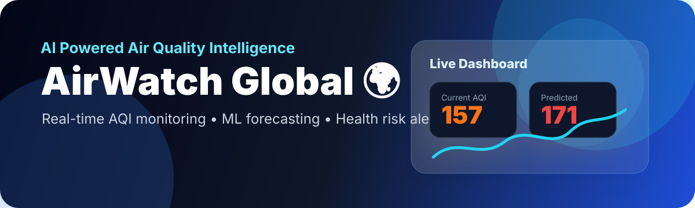
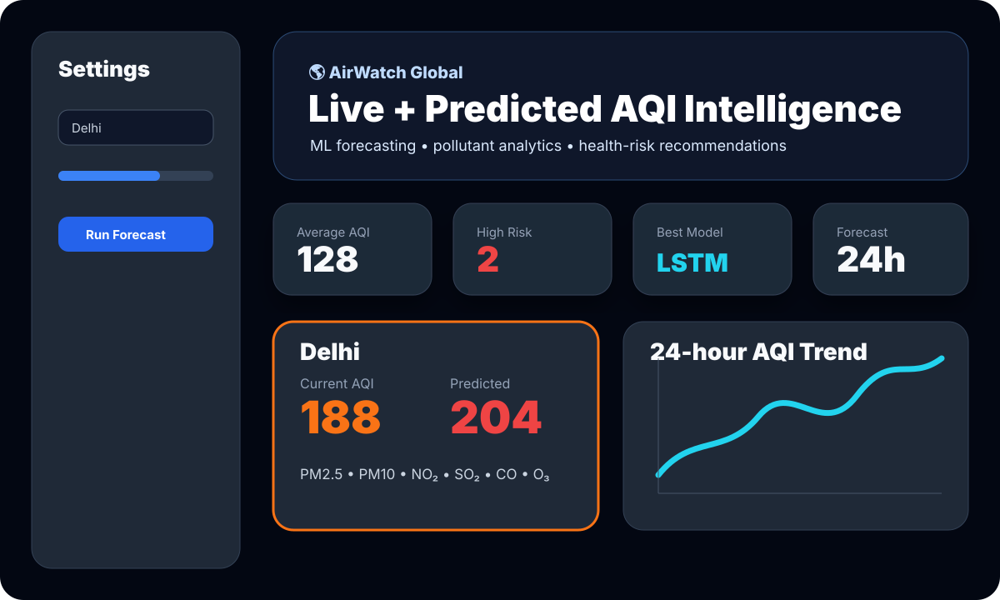

<div align="center">



# 🌍 AirWatch Global

### AI Powered Air Quality Monitoring & Forecasting Platform

**Real-time AQI intelligence • Machine Learning forecasting • Health risk alerts • Recruiter-ready AI Engineering portfolio project**

[](https://www.python.org/)
[](https://streamlit.io/)
[](https://vitejs.dev/)
[](#-machine-learning-engine)
[](LICENSE)

<a href="#-live-preview">Live Preview</a> •
<a href="#-features">Features</a> •
<a href="#-architecture">Architecture</a> •
<a href="#-quick-start">Quick Start</a> •
<a href="#-future-enhancements">Roadmap</a>

</div>

---

## 📸 Live Preview

> The repository now includes a **GitHub Pages-compatible static portfolio dashboard** and a **Streamlit AI dashboard prototype**.

<div align="center">
  
</div>

### Open the working pages locally

| Experience | Command | What it shows |
| --- | --- | --- |
| **Static portfolio website** | `python -m http.server 4173` then open `http://localhost:4173/index.html` | GitHub Pages-ready landing page with dark theme, glass cards, hero, chart, ML pipeline, and recruiter-focused project story |
| **Vite frontend preview** | `npm install` then `npm run dev` | Modern static frontend development flow for the portfolio dashboard |
| **Streamlit dashboard** | `streamlit run streamlit_app.py` | Interactive AQI dashboard prototype with city filters, KPI cards, AQI forecast tab, model comparison, and workflow view |

---

## 📌 Overview

**AirWatch Global** is a professional AI Engineering project that demonstrates how real-time environmental data can become actionable air-quality intelligence. The platform concept collects AQI data from environmental APIs, analyzes pollutant patterns, predicts future AQI with Machine Learning models, classifies health risk, and displays insights in a polished dashboard.

This project is designed for portfolio review: recruiters can quickly see the product idea, architecture, AI workflow, frontend presentation, and deployment path.

---

## 🚨 Problem Statement

Air pollution impacts daily health decisions, but most AQI tools only show current conditions. They often miss predictive forecasting, pollutant-level interpretation, and actionable recommendations. AirWatch Global solves this by combining:

- real-time AQI monitoring,
- pollutant analytics,
- Machine Learning prediction,
- health risk classification,
- and smart environmental alerts.

---

## ✨ Features

| Feature | Description |
| --- | --- |
| ✅ Real-time AQI monitoring | API-ready architecture for live environmental data ingestion |
| ✅ City-based AQI search | Focus dashboard insights on selected cities |
| ✅ Pollutant tracking | PM2.5, PM10, NO₂, SO₂, CO, and O₃ monitoring |
| ✅ ML AQI forecasting | Predict future AQI using pollutant, time, and weather features |
| ✅ Pollution category detection | Classify AQI into Good, Moderate, Unhealthy, Very Unhealthy, and Hazardous states |
| ✅ Health risk prediction | Convert AQI severity into user-friendly risk labels |
| ✅ Smart alerts | Highlight unhealthy predicted conditions before they peak |
| ✅ Interactive dashboard | Premium UI with cards, charts, controls, and recommendation panels |

---

## 🖥️ AirWatch Global Dashboard

The dashboard is designed like a premium AI product interface.

### Dashboard Cards

- **Current AQI** — live or latest AQI reading
- **Predicted AQI** — forecasted AQI for the selected time horizon
- **Pollutants** — PM2.5, PM10, NO₂, SO₂, CO, O₃ concentration drivers
- **Health Risk** — recommended action based on AQI category

### Dashboard Sections

- **Hero:** `AirWatch Global 🌍` and `AI Powered Air Quality Intelligence`
- **Live AQI Cards** for fast city-level status
- **Prediction Cards** for next-step risk detection
- **City Search** for location-specific insights
- **Pollutant Graphs** for explainable AQI drivers
- **AQI Trend Visualization** for forecast review
- **Health Recommendation Panel** for user action guidance

---

## 🧠 Machine Learning Engine

```text
Data Collection
      ↓
Preprocessing
      ↓
Feature Engineering
      ↓
Model Training
      ↓
AQI Prediction
      ↓
Health Risk Classification
```

### Models Used / Planned

| Model | Purpose | Why it matters |
| --- | --- | --- |
| **Random Forest Regressor** | Pollutant-based AQI prediction | Handles nonlinear relationships between pollutants and AQI |
| **ARIMA** | Time-series forecasting | Provides statistical trend forecasting baseline |
| **LSTM Neural Network** | Long-term AQI trend prediction | Learns sequential patterns from historical AQI windows |

### Dataset & API Sources

- **OpenAQ API** — open environmental air-quality measurements
- **AQI API** — city-level AQI and pollutant readings
- **Historical pollution datasets** — model training, backtesting, and validation

---

## 🏗️ Architecture

```text
┌─────────────────────────────┐
│ Environmental Data Sources  │
│ OpenAQ API / AQI API        │
└──────────────┬──────────────┘
               │
               ▼
┌─────────────────────────────┐
│ Python Backend              │
│ Flask / FastAPI             │
└──────────────┬──────────────┘
               │
               ▼
┌─────────────────────────────┐
│ AI Forecasting Layer        │
│ Random Forest / ARIMA / LSTM│
└──────────────┬──────────────┘
               │
               ▼
┌─────────────────────────────┐
│ Dashboard Layer             │
│ GitHub Pages / Streamlit    │
└──────────────┬──────────────┘
               │
               ▼
┌─────────────────────────────┐
│ Users / Recruiters          │
│ AQI Insights & Alerts       │
└─────────────────────────────┘
```

---

## 🧰 Technology Stack

| Layer | Technologies |
| --- | --- |
| **Frontend** | React, Vite, Tailwind CSS, Chart.js, HTML/CSS static GitHub Pages UI |
| **Dashboard Prototype** | Streamlit |
| **Backend** | Python, Flask/FastAPI |
| **AI / ML** | Scikit-learn, TensorFlow, Pandas, NumPy |
| **Forecasting** | Random Forest Regressor, ARIMA, LSTM Neural Network |
| **Deployment** | GitHub Pages, Streamlit Community Cloud |

---

## 📁 Repository Structure

```text
.
├── assets/
│   ├── airwatch-banner.svg       # README project banner
│   └── dashboard-preview.svg     # README dashboard preview image
├── index.html                    # GitHub Pages-compatible landing dashboard
├── package.json                  # Vite scripts for frontend preview
├── README.md                     # Interactive portfolio documentation
├── requirements.txt              # Python dependencies
└── streamlit_app.py              # Streamlit AQI dashboard prototype
```

---

## ⚡ Quick Start

### 1️⃣ Clone the repository

```bash
git clone <your-repository-url>
cd Air_Qality_Index
```

### 2️⃣ Run the GitHub Pages-compatible static dashboard

```bash
python -m http.server 4173
```

Open:

```text
http://localhost:4173/index.html
```

### 3️⃣ Run the Vite frontend workflow

```bash
npm install
npm run dev
```

### 4️⃣ Run the Streamlit AI dashboard prototype

```bash
pip install -r requirements.txt
streamlit run streamlit_app.py
```

---

## 🔐 Environment Variables

Create a `.env` file when you connect real AQI APIs:

```env
AQI_API_KEY=your_api_key
```

---

## 🚀 Deployment

### GitHub Pages

Use `index.html` as the static portfolio page. It is compatible with GitHub Pages because it does not require a Python server.

### Streamlit Community Cloud

Deploy the AI dashboard prototype with:

```text
streamlit_app.py
```

---

## 🗺️ Future Enhancements

- IoT sensor integration for hyperlocal AQI monitoring
- Weather API integration for better model features
- Mobile application for air-quality alerts
- Global AQI heatmap with geospatial visualization
- AI chatbot for pollution advice
- Automated model retraining pipeline
- FastAPI prediction service
- Real OpenAQ/AQI API integration with caching

---

## 💼 Why This Project Stands Out

AirWatch Global demonstrates end-to-end AI Engineering skills:

- product thinking,
- API integration planning,
- data preprocessing workflow,
- Machine Learning forecasting,
- time-series modeling,
- dashboard UI design,
- deployment awareness,
- and recruiter-friendly documentation.

<div align="center">

### ⭐ If you like this project, star the repository and use it as a reference for AI Engineering portfolio work.

</div>
